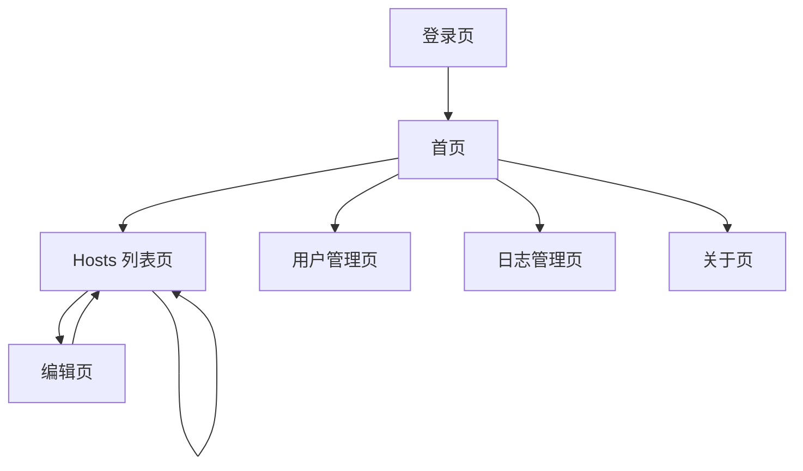

# Switch Hosts R 产品需求文档

## 1. 产品概述

Switch Hosts R 是一个简单易用的 hosts 文件管理工具，基于 Tauri 和 Vue3 技术栈开发的跨平台桌面应用。
该产品主要解决开发者在不同开发环境下频繁切换 hosts 配置的痛点，提供可视化的 hosts 文件编辑、管理和切换功能，支持本地和远程 hosts 文件管理。
产品定位为开发者工具，旨在提高开发效率，简化 hosts 文件管理流程。

## 2. 核心功能

### 2.1 用户角色

| 角色   | 注册方式       | 核心权限                     |
| ---- | ---------- | ------------------------ |
| 普通用户 | 邮箱注册或第三方登录 | 可管理个人 hosts 文件，查看操作日志    |
| 管理员  | 系统分配       | 可管理所有用户和 hosts 文件，查看系统日志 |

### 2.2 功能模块

我们的 Switch Hosts R 需求包含以下主要页面：

1. **首页**：欢迎界面，快速导航，应用状态概览
2. **Hosts 列表页**：hosts 文件列表展示，在线编辑器，状态切换
3. **编辑页**：独立的 hosts 文件编辑器，语法高亮
4. **用户管理页**：用户信息管理，权限设置
5. **日志管理页**：操作日志查看，系统日志监控
6. **登录页**：用户登录，注册，第三方登录
7. **关于页**：应用信息，版本说明，帮助文档

### 2.3 页面详情

| 页面名称      | 模块名称  | 功能描述                         |
| --------- | ----- | ---------------------------- |
| 首页        | 欢迎界面  | 显示应用欢迎信息，提供快速导航入口            |
| 首页        | 状态概览  | 展示当前激活的 hosts 配置，系统状态信息      |
| Hosts 列表页 | 文件列表  | 展示所有 hosts 文件，支持分页和搜索        |
| Hosts 列表页 | 在线编辑器 | 集成 Monaco Editor，支持语法高亮和实时编辑 |
| Hosts 列表页 | 状态管理  | 启用/禁用 hosts 文件，只读模式切换        |
| 编辑页       | 代码编辑器 | 独立的 hosts 文件编辑环境，支持格式化       |
| 用户管理页     | 用户列表  | 显示所有用户信息，支持用户搜索和筛选           |
| 用户管理页     | 用户操作  | 创建、编辑、删除用户，权限分配              |
| 日志管理页     | 操作日志  | 记录用户操作历史，支持日志筛选和导出           |
| 日志管理页     | 系统日志  | 显示系统运行日志，错误信息追踪              |
| 登录页       | 用户认证  | 邮箱密码登录，表单验证                  |
| 登录页       | 第三方登录 | GitHub 等第三方平台登录集成            |
| 关于页       | 应用信息  | 显示应用版本、作者信息、许可证              |

## 3. 核心流程

### 普通用户流程

用户首先通过登录页进行身份认证，登录成功后进入首页查看应用状态。用户可以在 Hosts 列表页查看和管理自己的 hosts 文件，通过内置编辑器进行实时编辑，或在独立的编辑页进行更复杂的编辑操作。用户可以在日志页面查看自己的操作历史。

### 管理员流程

管理员除了拥有普通用户的所有功能外，还可以在用户管理页面管理所有用户账户，在日志管理页面查看系统级别的操作日志，监控整个应用的运行状态。

## 4. 用户界面设计

### 4.1 设计风格

* **主色调**：#18a058（绿色主题），#2080f0（蓝色辅助）

* **中性色**：#ffffff（背景白），#000000（文字黑），#f5f5f5（浅灰背景）

* **按钮样式**：圆角按钮，支持 hover 和 pressed 状态

* **字体**：系统默认字体，代码编辑器使用等宽字体 Consolas/Monaco

* **布局风格**：左侧导航 + 主内容区域，卡片式组件布局

* **图标风格**：使用 Naive UI 内置图标和 Vicons 图标库

### 4.2 页面设计概览

| 页面名称      | 模块名称 | UI 元素                      |
| --------- | ---- | -------------------------- |
| 首页        | 欢迎界面 | 大标题，渐变背景，快速操作按钮组           |
| 首页        | 状态概览 | 状态卡片，数据统计，进度条显示            |
| Hosts 列表页 | 文件列表 | 左侧标签页导航，右侧编辑器面板            |
| Hosts 列表页 | 编辑器  | Monaco Editor 集成，深色主题，语法高亮 |

